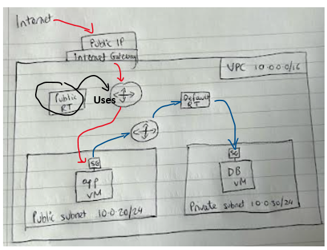
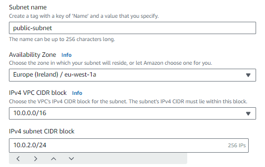
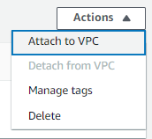
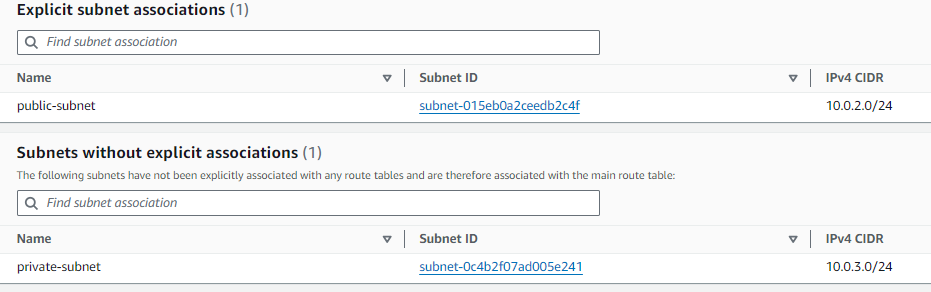
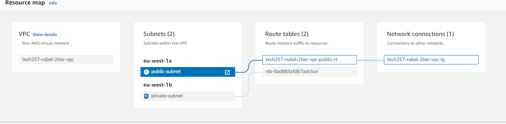
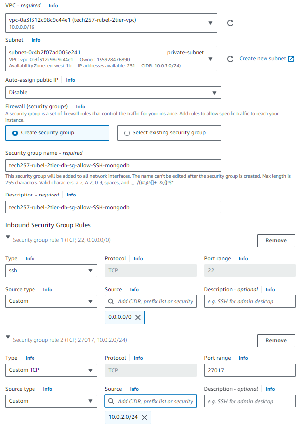
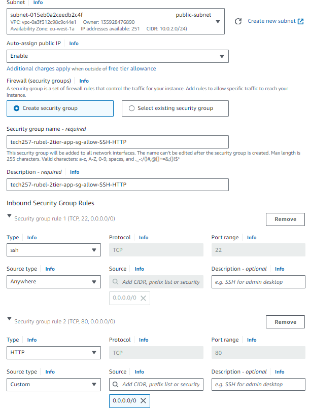
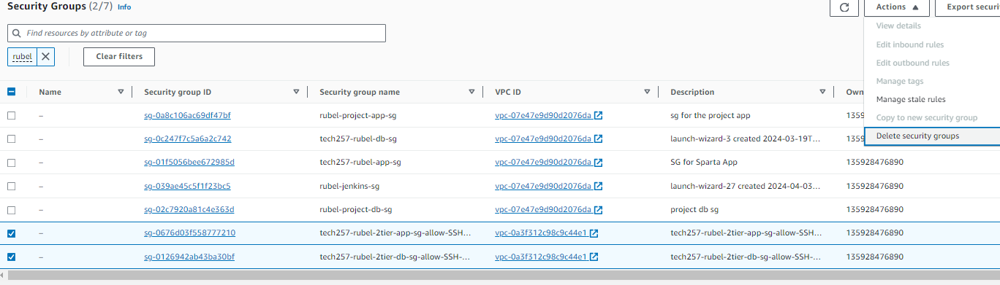
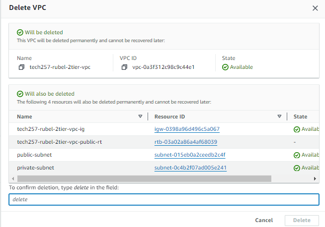

# Virtual Private Cloud (VPC)
**VPC is the AWS version of a virtual network. Its the apartment that has rooms and furniture inside. The rooms are subnets and the furniture being the instances inside.**
- By default, instances have default VPC but that has less security as many can use it
- Creating own one means more security, restrict what can access and can be routed
- What is included in a VPC:
  - Subnets
  - Route tables
  - Internet Gateway




## Creating a VPC and all that is associated to it
Go to the VPC section and click `Create VPC`
### Create VPC
1. `VPC only` - We want to setup all that is associated to this vpc ourselves so we only create VPC here
2. `Name` - appropriately name with vpc at end for best practice
3. `IP` - '10.0.0.0/16' 
4. `Create VPC`

### Subnets
1. Select the VPC just created as we want to put the subnets within this VPC
2. Subnet settings: 
   1. Subnet1 - Public Subnet: This is the subnet which the app vm goes in
      - AZ: 1a
      - IP : 10.0.2.0/24

    1. Subnet2: Private subnet: This is the subnet for the database
       - AZ: 1b
       - IP: 10.0.3.0/24


### Internet Gateway
1. Go to Internet Gateway 
2. Create
3. Name it with vpc and ig to show it is the internet gateway of a vpc
4. Attach it to the VPC

1. Select the VPC created and attach

### Public Route Table
1. Go to the Route Tables and create
2. Give it a name and select your VPC which will associate the route table to the vpc
3. Go to the route table as we need to assign it to the public subnet:
   1. `Subnet associations` - edit your subnet associations
   2. Click ONLY public subnet and save which will associate the subnet to the route table
      - private subnet will be associated to the default route table   
4. `Routes`: Allow route access from internet gateway
   1. `Edit routes`
   2. `Add route`
   3. Select the target to be the Internet gateway and select your one (there should only be 1 gateway as that gateway is already associated with the vpc)
   4. `Destination` - 0.0.0.0/0 can be anywhere


### How to see if the VPC has all the necessary configurations
1. Go to your VPC
2. `Resource Map` - This should show everything you have created and the associations if correct. Make sure to double check everything


## 2 tier Deployment
Now that the VPC is created, we can deployment the app and database within this VPC:
### Database Instance
1. To create, you can use any method but quickest is using custom AMI
2. Create database AMI:
   1. Configure database instance using User data and include the database script. Test and then create AMI from this.
3. `Launch Instance from this AMI` 
4. Name
5. `Type` - t2.micro
6. `Key pair` - add your ssh key
7. `Network settings`
   1. VPC: Select the custom VPC
   2. Select which subnet the database instance will go in which is the private one
   3. Disable auto assign public IP as we dont need it
   4. `Create security group` - we want to create a new one as any existing one wont work as it isnt within this VPC
         - setup ports for ssh(22) and mongodb(27017)
         - The db port we can choose its source ip to be the one for the public subnet

### App Instance
1. Create App AMI:
   1. Configure app database instance using User data and then create AMI from this
2. `Launch Instance from this AMI`
3. Name
4. `Type` - t2.micro
5. `Key pair` - add your ssh key
6. `Network settings`
   1. VPC: Select the custom VPC
   2. Select which subnet the app instance will go in which is the app instance
   3. Enable auto assign public IP 
   4. `Create security group` - we want to create a new one as any existing one wont work as it isnt within this VPC
      1. Use ssh and http ports

7. User data - We need to add a little bit of user data to cd into the app, install npm to seed the data and export the environment variable
```
#!/bin/bash

export DB_HOST=mongodb://10.0.3.67:27017/posts

cd /tech257_sparta_app/app

npm install

node seeds/seed.js

pm2 kill 

pm2 start app.js
```

## Clean UP
1. Delete both instances
2. Delete the Security Groups

3. Delete the VPC which will show you it will delete all things associated to that VPC
