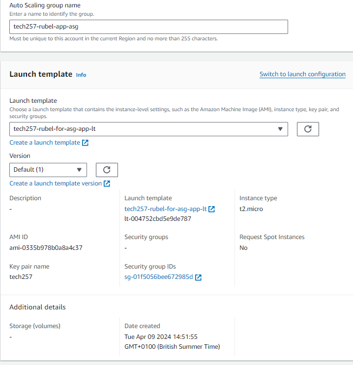
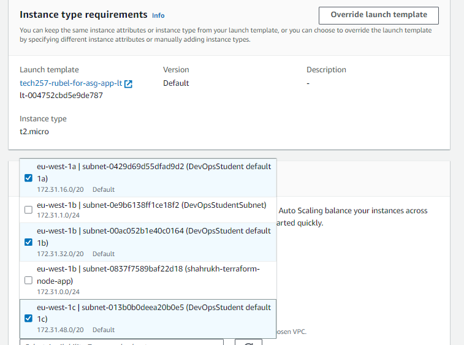
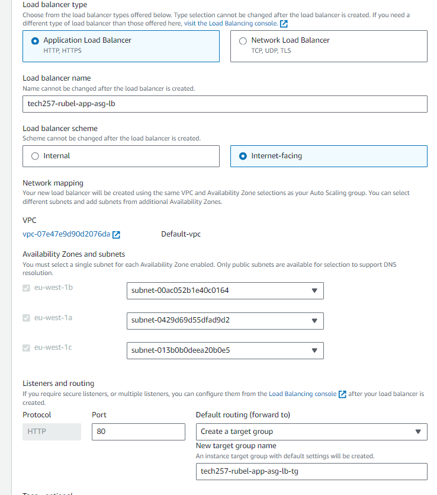
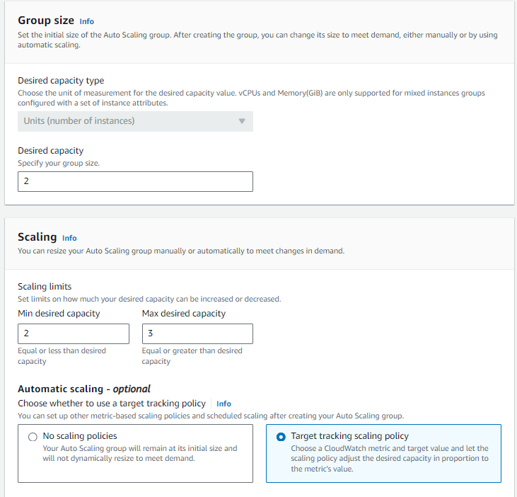

# Autoscaling Groups (ASG)
AWS is different to Azure in the sense where it uses a image, but using that image, a launch template is created for the auto scale group to use. 

## Creating Autoscaling Group
### AMI and Launch Template
**The app is run using an AMI created with all the dependencies already installed as it make it quicker. This AMI is used to create a launch template which creating an ASG REQUIRES. Launch template is needed because it provides the ASG with all the necessary configurations for the instances.**
1. Create ec2 using user data to get the app running
2. Use this ec2 to create an image, and then use this image to make a launch template
### Launch Template:
1. Go to `Launch templates` and launch one
2. Set an appropriate name
3. `AMI` = specify your AMI that was created with the user data
4. `Instance type` = t2.micro
5. `key pair` = add your ssh key
6. `Network` = security group with all necessary ports open
7. `Advanced Details` = User Data: add the little bit of user data that is used to cd into the app and stop/start pm2 to run the app
8. `Create Launch Template` - **This will be used to create the ASG however firstly:**
   1. Test this template works
   2. `Launch instance with template`
   3. Everything will already be configured, if anything is missing it means the template has something missing
   4. Launch the instance and run the app

### Create Autoscaling Group
1. `Create Autoscaling` withing the ASG tab
2. Name appropriately
3. Specify your launch template
   
4. `Launch options` = Add Availability Zones that have subnets associated with them
   
5. `Configure Advanced options`:
   1. `Load balancer` = attach a new one
      1. Application Load Balancer (We need access from HTTPS HTTP)
      2. Change name 
      3. Internet-facing (user accessed from internet)
      4. `Create Target group` = add tg to the name
   
   2. `Health checks` = uses health checks to increase availability
      1. Turn on Elastic Load Balancing health checks
6. `Configure group size and scaling` - capacity
   1. `Group size` = change desired to 2 as we want 2 vms to increase availability as if one goes down there will always be another one to rely on
   2. `Scaling` - 
      1. Min: 2 Max: 3 - need to always have 2 instances running and a 3rd to be added in case fail over
   
      2. `Automatic Scaling` - add a target policy with the default configurations fine
   3. `Instance maintenance policy` - Launch before terminating
7. `Tags` - add Key:Name and Value:Tag preferably the name of the ASG
8. Review and create the ASG, it should have created, the ASG, load balancer, target group and attached to the ASG

### Testing if app works
1. The DNS name of the load balancer is what we need to see if the app is running

### Testing if Autoscaling works
If you terminate an instance, in theory it should create a new one. 

### Cleaning up the Autoscaling Group
1. Delete the load balancer first
2. Delete the Target Group
3. Delete the ASG