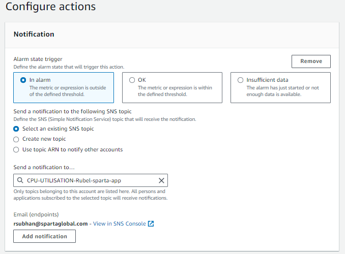

# Alarm

## Creating CPU Usage Alarm
1. Go to CloudWatch alarms
2. Create new alarm
3. Search your instance id
4. Select the instance but the column with CPUUtilisation metric and bottom right select `select metric`
5. Specify the conditions that need to be met
   
6. Create a notification by `create new topic` and use your email as the endpoint

## Testing
1. SSH into the app
2. run the update and upgrade commands
3. If it triggers, on the interface, it changes the state to 'In alarm' with a red warning
   