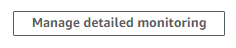
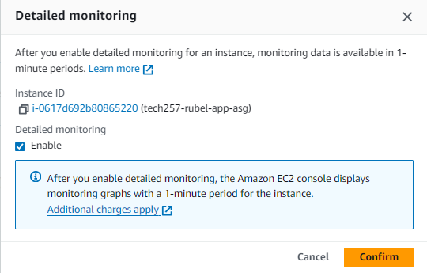
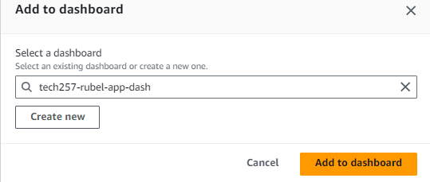
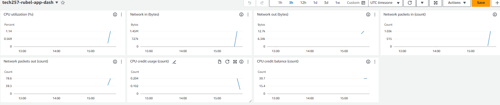

# AWS Dashboard
**Dashboard is used to monitor metrics of services that you wish to monitor. By default, it monitors at intervals of 5 minutes.**
- Enable detailed monitoring which will allow selection of intervals less than 5 minutes
  
 

After enabling, you can choose intervals of 1 minute or even up to 1 second

## Creating a dashboard
1. `Add to Dashboard` - this will take you to a new window and ask you either select a dashboard or create one

   
1. `Create New` - After naming it, select create new to create it and then add it

