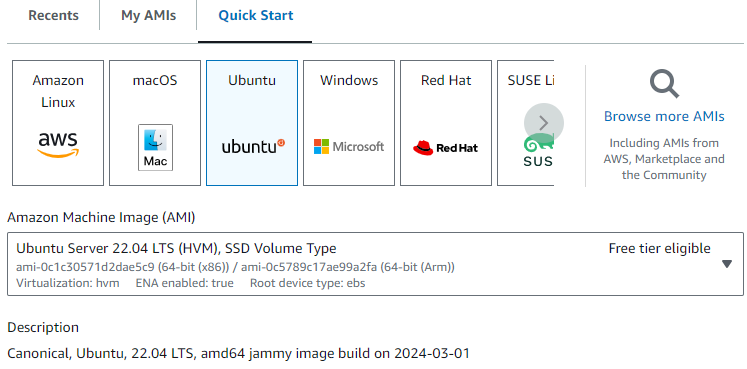
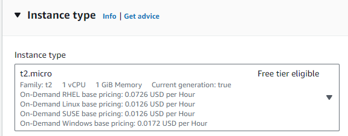
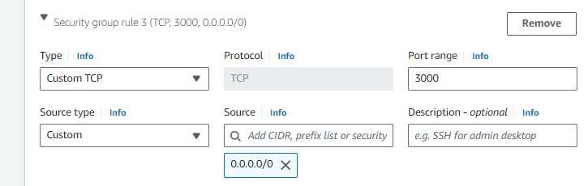
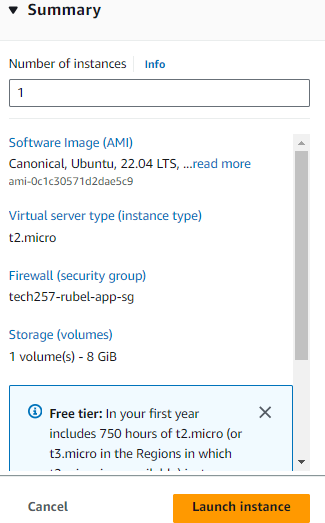
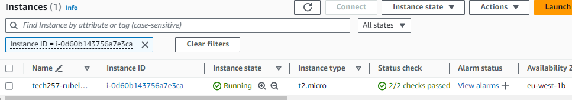

# Introduction to AWS

## EC2
### What is it?
EC2 = Elastic Compute Cloud
- AWS Version of a virtual machine
- Elastic as it allows scalability just like an elastic band can be stretched when wanted and also back to normal when wanted

### Creating EC2 
1. `name` = Name it appropriately to what the ec2 will be used for
2. `image` = the OS used with all preset configurations to be used. Can be your own one or one provided
   
3. `Instance type` = Size of instance. First part (t2) stands for the family type and the second part (.micro) stands for the size within that family
   
4. `Key pair` = keypair used wen logging in
5. `Network seting` = The Security group and rules allowed 
   - Click edit to change name and add new rules

6. Summary: AWS provides a summary of what has been selected. Good for reviewing 
   
7. Viewing the instances: You can see whether it has initialised, whether it is running etc.
   

## Connecting through SSH
1. Click Instance ID and it will take you to the instance with all details of it 
2. `Connect` = will show you how to connect and we will use ssh
3. copy paste the ssh link and ssh into the ec2

## Manually getting app to work
1. Follow script commands 
2. If Ubuntu 22.04 is used, a restart config file was added and as default it has the restart as interactive so an extra step will be needed:
   1. `sudo nano /etc/needrestart/needrestart.conf` 
   2. `#$nrconf{restart} = 'i';`  
Uncomment and change to:
`$nrconf{restart} = 'a';` to restart services automatically

## Script
```
#!/bin/bash

# change restart function to auto 
sed -i "s/#\$nrconf{restart} = 'i';/\$nrconf{restart} = 'a';/" /etc/needrestart/needrestart.conf

# update and upgrade without user intervention
sudo apt update -y
sudo DEBIAN_FRONTEND=noninteractive apt-get upgrade -y

# install nginx
sudo apt install nginx -y
sudo sed -i "s|try_files .*;|proxy_pass http://127.0.0.1:3000;|g" /etc/nginx/sites-available/default

# enable nginx and be able to restart everytime
sudo systemctl restart nginx
sudo systemctl enable nginx

# download node.js
curl -fsSL https://deb.nodesource.com/setup_20.x | sudo -E bash - &&\

# installl node.js
sudo apt-get install -y nodejs

# Retrieving the app folder from the git repo
git clone https://github.com/srubel19065/tech257_sparta_app.git

# getting into the app folder
cd tech257_sparta_app/app/

# creating env variable to establish connection through priv ip
# export DB_HOST=mongodb://<priv ip>:27017/posts

# installing npm
npm install

# installing pm2 
sudo npm install pm2@latest -g

# stop pm2 before rerunning
pm2 stop app.js

# start pm2 
pm2 start app.js

pm2 save 


```