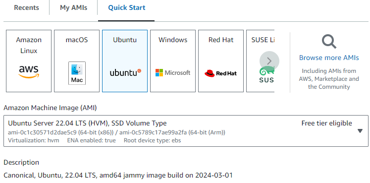
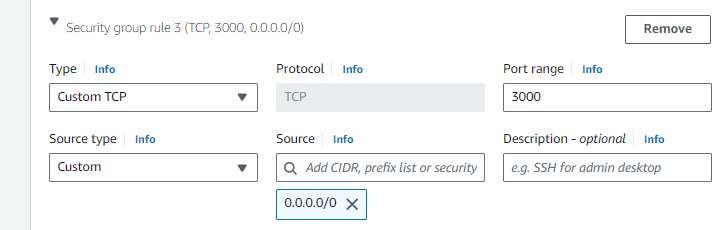
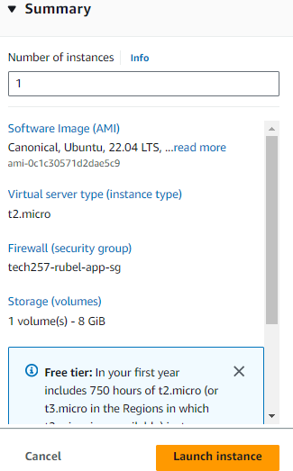
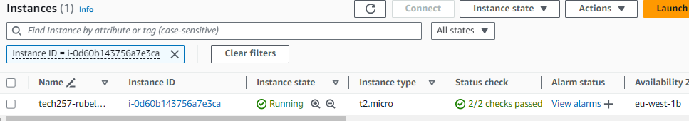

# Introduction to AWS
- [Introduction to AWS](#introduction-to-aws)
  - [EC2](#ec2)
    - [What is it?](#what-is-it)
    - [Creating EC2](#creating-ec2)
    - [Connecting through SSH](#connecting-through-ssh)
  - [2 Tier AWS Deployment](#2-tier-aws-deployment)
    - [Manually getting app to work](#manually-getting-app-to-work)
  - [Script for Deploying App](#script-for-deploying-app)
  - [Deploying Database](#deploying-database)
    - [Manually](#manually)
    - [Script for deploying database](#script-for-deploying-database)
  - [How to connect database with the app](#how-to-connect-database-with-the-app)
  - [AWS Vs Azure](#aws-vs-azure)


## EC2
### What is it?
EC2 = Elastic Compute Cloud
- AWS Version of a virtual machine
- Elastic as it allows scalability just like an elastic band can be stretched when wanted and also back to normal when wanted

### Creating EC2 
1. `name` = Name it appropriately to what the ec2 will be used for
2. `image` = the OS used with all preset configurations to be used. Can be your own one or one provided
   
3. `Instance type` = Size of instance. First part (t2) stands for the family type and the second part (.micro) stands for the size within that family
   
4. `Key pair` = keypair used wen logging in
5. `Network seting` = The Security group and rules allowed 
   - Click edit to change name and add new rules

6. Summary: AWS provides a summary of what has been selected. Good for reviewing 
   
7. Viewing the instances: You can see whether it has initialised, whether it is running etc.
   

### Connecting through SSH
1. Click Instance ID and it will take you to the instance with all details of it 
2. `Connect` = will show you how to connect and we will use ssh
3. copy paste the ssh link and ssh into the ec2

## 2 Tier AWS Deployment
### Manually getting app to work
1. If Ubuntu 22.04 is used, a restart config file was added and as default it has the restart as interactive so an extra step will be needed:
   1. `sudo nano /etc/needrestart/needrestart.conf` 
   2. `#$nrconf{restart} = 'i';`  
Uncomment and change to:
`$nrconf{restart} = 'a';` to restart services automatically
1. ` sudo apt update -y`
2. `sudo DEBIAN_FRONTEND=noninteractive apt-get upgrade -y` - these two steps update and upgrade all files and dependencies without user intervemtion needed
3. `sudo apt install nginx -y` - installs nginx
4. Go into `/etc/nginx/sites-available/deafult` - and change 'try files' line to `proxy_pass http://127.0.0.1:3000;` - sets up a proxy pass so we dont need to open port 3000 not enter in browser, it will auto redirect to there
5. `sudo systemctl restart nginx
sudo systemctl enable nginx` - restart and enable nginx
6. download node.js -
`curl -fsSL https://deb.nodesource.com/setup_20.x | sudo -E bash - &&\`
7. `sudo apt-get install -y nodejs` - install node.js
8. `git clone https://github.com/srubel19065/tech257_sparta_app.git` - clone into git repo where app folder is
9. `cd tech257_sparta_app/app/` - cd into app folder
10. create env variable for the connection between app and database - `export DB_HOST=mongodb://10.0.3.5:27017/posts`
11. ```
    #installing npm
    npm install

    #installing pm2 
    sudo npm install pm2@latest -g

    #stop pm2 before rerunning
    pm2 stop app.js

    #start pm2 
    pm2 start app.js
    ```

## Script for Deploying App
Create a shell script - `nano ....sh` and insert script, save, change permisions to execute then execute the script
```
#!/bin/bash

# change restart function to auto 
sed -i "s/#\$nrconf{restart} = 'i';/\$nrconf{restart} = 'a';/" /etc/needrestart/needrestart.conf

# update and upgrade without user intervention
sudo apt update -y
sudo DEBIAN_FRONTEND=noninteractive apt-get upgrade -y

# install nginx
sudo apt install nginx -y
sudo sed -i "s|try_files .*;|proxy_pass http://127.0.0.1:3000;|g" /etc/nginx/sites-available/default

# enable nginx and be able to restart everytime
sudo systemctl restart nginx
sudo systemctl enable nginx

# download node.js
curl -fsSL https://deb.nodesource.com/setup_20.x | sudo -E bash - &&\

# installl node.js
sudo apt-get install -y nodejs

# Retrieving the app folder from the git repo
git clone https://github.com/srubel19065/tech257_sparta_app.git

# getting into the app folder
cd tech257_sparta_app/app/

# creating env variable to establish connection through priv ip, uncomment when needed
# export DB_HOST=mongodb://<priv ip>:27017/posts

# installing npm
npm install

# installing pm2 
sudo npm install pm2@latest -g

# stop pm2 before rerunning
pm2 stop app.js

# start pm2 
pm2 start app.js

pm2 save 
```

## Deploying Database
1. Create EC2 with standard config
2. Make Security Group and have ports 22 for SSH and 27017 for MongoDB open to allow the app to access the app
3. SSH into the database ec2

### Manually 
1. `sudo nano /etc/needrestart/needrestart.conf` 
   2. `#$nrconf{restart} = 'i';`  
Uncomment and change to:
`$nrconf{restart} = 'a';` to restart services automatically
2. ` sudo apt update -y`
2. `sudo DEBIAN_FRONTEND=noninteractive apt-get upgrade -y` - these two steps update and upgrade all files and dependencies without user intervemtion needed
3. `curl -fsSL https://www.mongodb.org/static/pgp/server-7.0.asc | \
   sudo gpg -o /usr/share/keyrings/mongodb-server-7.0.gpg \
   --dearmor` - downloads mongoDB
4. `echo "deb [ arch=amd64,arm64 signed-by=/usr/share/keyrings/mongodb-server-7.0.gpg ] https://repo.mongodb.org/apt/ubuntu jammy/mongodb-org/7.0 multiverse" | sudo tee /etc/apt/sources.list.d/mongodb-org-7.0.list` - creates list file
5. `sudo apt-get update -y` - reupdate
6. `sudo apt-get install -y mongodb-org=7.0.6 mongodb-org-database=7.0.6 mongodb-org-server=7.0.6 mongodb-mongosh=2.1.5 mongodb-org-mongos=7.0.6 mongodb-org-tools=7.0.6` - install mongoDB
7. `sudo systemctl start mongod
sudo systemctl enable mongod` 


### Script for deploying database
```
#!/bin/bash

# change restart function to auto 
sed -i "s/#\$nrconf{restart} = 'i';/\$nrconf{restart} = 'a';/" /etc/needrestart/needrestart.conf

# update
sudo apt update -y

# This upgrade makes all upgrades noninteractive and dont need user input
sudo DEBIAN_FRONTEND=noninteractive apt-get upgrade -y

# download mongoDB
curl -fsSL https://www.mongodb.org/static/pgp/server-7.0.asc | \
   sudo gpg -o /usr/share/keyrings/mongodb-server-7.0.gpg \
   --dearmor

# creates a list file
echo "deb [ arch=amd64,arm64 signed-by=/usr/share/keyrings/mongodb-server-7.0.gpg ] https://repo.mongodb.org/apt/ubuntu jammy/mongodb-org/7.0 multiverse" | sudo tee /etc/apt/sources.list.d/mongodb-org-7.0.list

# reupdate
sudo apt-get update -y

# install mongoDB 
sudo apt-get install -y mongodb-org=7.0.6 mongodb-org-database=7.0.6 mongodb-org-server=7.0.6 mongodb-mongosh=2.1.5 mongodb-org-mongos=7.0.6 mongodb-org-tools=7.0.6
 
# will change the bindip to 0.0.0.0
sudo sed -i 's@127.0.0.1@0.0.0.0@' /etc/mongod.conf

# start and enable mongoDB
sudo systemctl start mongod
sudo systemctl enable mongod
```

## How to connect database with the app
1. For the app to recognise the database, we need an environment variable with established the ip of the database. `export DB_HOST=mongodb://<db ip:27017/posts`
2. If it is fresh Vms, run the database script
3. Run the app script
4. Use the app IP in the browser and followed by /posts to see the database page.


## AWS Vs Azure
1. Dynamic vs Static IP
   - AWS: Dynamic (changes every time)
   - Azure: Static (stays the same)
2. Creating image
   - Azure: need to use CLI to run some commands, and the instance cant be used after
   - AWS: simpler
3. Resource groups
   - Azure: must go in a RG
   - AWS: can use RG for organisation but not necessary
4. Virtual Network
   - Azure: need to create your own from the beginning
   - AWS: VPC is created by default to be used 
5. Terminology
6. Autoscaling
   - Azure: 
     - With the image the scale sets are created
     - AZ's have one subnet for all 3
   - AWS:
     - A launch template us used by the autoscaling group so it gets all the configurations
     - AZ's have a subnet linked to them EACH
7. Dashboard:
   - Azure: Intervals of a minute by default
   - AWS: Need to enable detailed monitoring to get smaller intervals like a minute
8. Security Groups:
   - Azure: Security group can link to NIC or subnet 